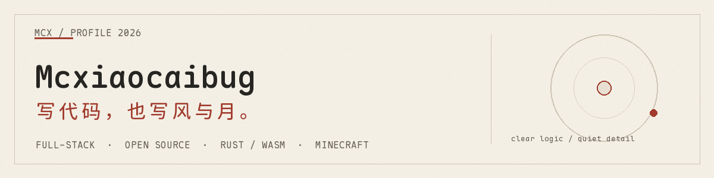

  

我在浏览器、服务器与边缘网络之间写代码，也为 Minecraft 做工具。喜欢把复杂的事物，做得安静、清楚、耐用。

**此刻：** `Rust / WebAssembly` · `Full-stack / Open Source` · `Minecraft`

### 最近在写

<!-- RECENT_WORK:START -->
- `08-23 16:27` 在 [VerdantGolemMC/VerdantGolem](https://github.com/VerdantGolemMC/VerdantGolem) 提交 [fix: format_push_string in /info](https://github.com/VerdantGolemMC/VerdantGolem/commit/e80fe838c9c2c508ce410d984f55a2978a270fb9)
- `08-23 16:20` 在 [VerdantGolemMC/VerdantGolem](https://github.com/VerdantGolemMC/VerdantGolem) 提交 [fix: remaining batch-3 warnings (Display for to-position, unused binding](https://github.com/VerdantGolemMC/VerdantGolem/commit/4483c2d65097e7f75d934fb289e0d049c98136e4)
- `08-23 16:15` 在 [VerdantGolemMC/VerdantGolem](https://github.com/VerdantGolemMC/VerdantGolem) 提交 [fix: /info command imports and error lifetime](https://github.com/VerdantGolemMC/VerdantGolem/commit/83fb08e01ab2500d24189605c782b18ac0f17ad3)
- `08-23 16:14` 在 [VerdantGolemMC/VerdantGolem](https://github.com/VerdantGolemMC/VerdantGolem) 提交 [fix: batch-3 compile errors (Hand variant, Arc move, Display, Taggable i](https://github.com/VerdantGolemMC/VerdantGolem/commit/f07b1d97a7f2c27846ed2610e451e6c805a9617a)
- `08-23 16:07` 在 [VerdantGolemMC/VerdantGolem](https://github.com/VerdantGolemMC/VerdantGolem) 提交 [feat: fake-player actions, renewableSponces, /info and /distance](https://github.com/VerdantGolemMC/VerdantGolem/commit/892cd354ad8336241cc1d45d8c22d0ce089f5e3f)
<!-- RECENT_WORK:END -->

### 两件作品

- [AzureDreamWebsite](https://github.com/Mcxiaocaibug/AzureDreamWebsite) — 一座现代、流动的社区网站
- [Neptunium Web](https://github.com/Mcxiaocaibug/neptunium-web) — Minecraft 基岩版投影文件管理系统

更多内容在 <a href="https://mcxiaocaibug.github.io">mcxiaocaibug.github.io</a> · Typeset in <a href="https://github.com/subframe7536/maple-font">Maple Mono</a>
