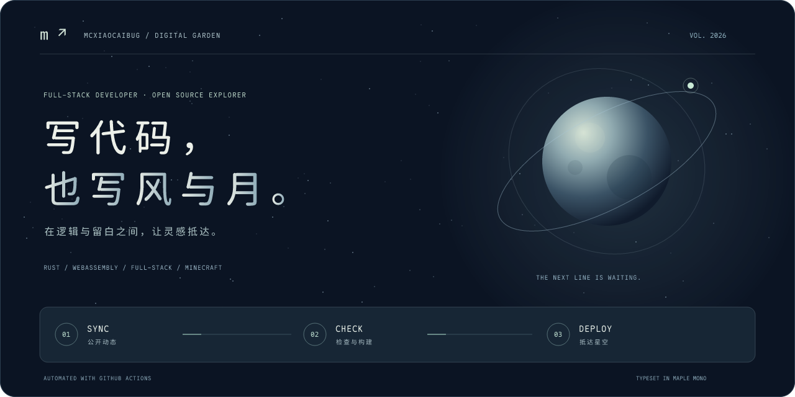

  

我在浏览器、服务器与边缘网络之间写代码，也为 Minecraft 做工具。喜欢把复杂的事物，做得安静、清楚、耐用。

**此刻：** `Rust / WebAssembly` · `Full-stack / Open Source` · `Minecraft`

### 最近在写

<!-- RECENT_WORK:START -->
- `09-30 20:42` 在 [Pumpkin](https://github.com/Mcxiaocaibug/Pumpkin) 提交 [fix(piston): update block swap fixes for current server](https://github.com/Mcxiaocaibug/Pumpkin/commit/c51f8ddb44e9ebe4e4c0e42217e5017cfcecfc52)
- `09-30 20:30` 在 [Pumpkin](https://github.com/Mcxiaocaibug/Pumpkin) 提交 [fix(command): update perf for synchronous execution](https://github.com/Mcxiaocaibug/Pumpkin/commit/5b916f4d30ced780cc2bdc6734d677a6a060700a)
- `09-12 21:13` 在 [VerdantGolemMC/VerdantGolem](https://github.com/VerdantGolemMC/VerdantGolem) 提交 [fix: gate post-commit sync errors on supported platforms](https://github.com/VerdantGolemMC/VerdantGolem/commit/4ff9d1eea516a6eec332abca22dead5ad17a2187)
- `09-12 19:34` 在 [VerdantGolemMC/VerdantGolem](https://github.com/VerdantGolemMC/VerdantGolem) 发起 [#1 feat: technical survival completion and verified upstream sync](https://github.com/VerdantGolemMC/VerdantGolem/pull/1)
<!-- RECENT_WORK:END -->

### 两件作品

- [AzureDreamWebsite](https://github.com/Mcxiaocaibug/AzureDreamWebsite) — 一座现代、流动的社区网站
- [Neptunium Web](https://github.com/Mcxiaocaibug/neptunium-web) — Minecraft 基岩版投影文件管理系统

更多内容在 <a href="https://mcxiaocaibug.github.io">mcxiaocaibug.github.io</a> · Typeset in <a href="https://github.com/subframe7536/maple-font">Maple Mono</a>
